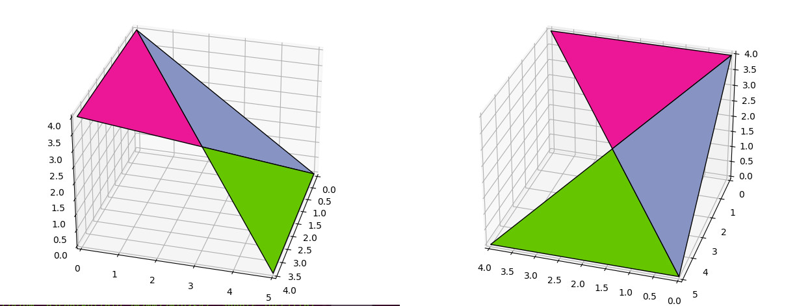
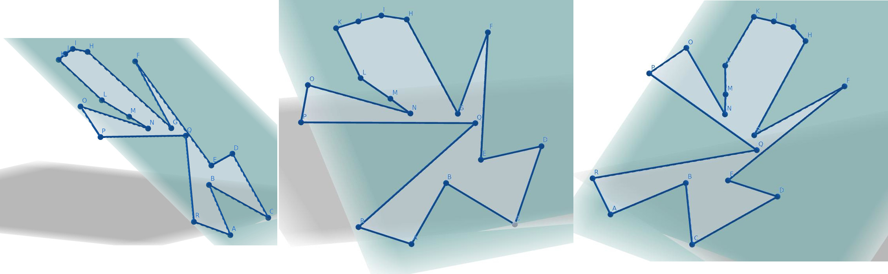
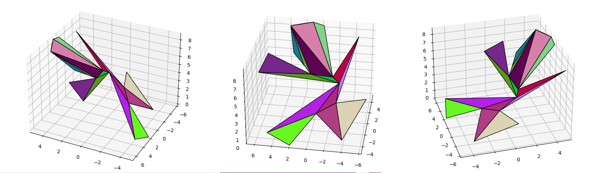

# rs-3d-polygon-to-triangles

## Purpose

## Testing

cargo test

- check the results
- go in python_testing/
    - python3 -m venv env
    - . env/bin/activate
    - pip install -r requirements.txt
    
    then launch all the python test*.py files
    
    i.e.:
    - python3 test2.py
    
### Example of result for test2.py

### Example of result for test3.py
#### example from Geogebra

#### result
